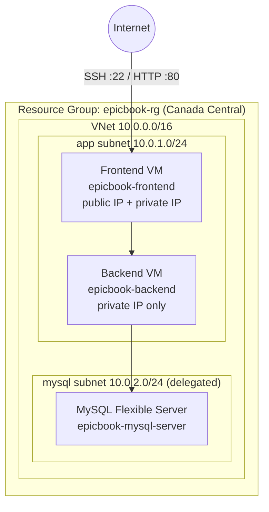

# infra-epicbook
# infra-epicbook

Infrastructure-as-Code for the **EpicBook** application. This repository provisions the Azure environment (network, virtual machines, and a managed MySQL database) with [Terraform](https://www.terraform.io/), and deploys it automatically through an [Azure DevOps pipeline](https://learn.microsoft.com/azure/devops/pipelines/).

Deployment is done via the pipeline — pushing to `main` runs Terraform on an Azure DevOps agent and applies the changes. Running Terraform by hand is optional and only needed for teardown or debugging.

## Overview

The Terraform configuration stands up a two-tier application environment in Azure, plus a managed database on a private, delegated subnet:

- A **frontend VM** with a public IP (reachable over SSH and HTTP)
- A **backend VM** on a private IP only (no public exposure)
- A **MySQL Flexible Server** on its own delegated subnet, resolved through a private DNS zone
- Networking, a network security group, and Terraform remote state in Azure Blob Storage



## Repository structure

| File | Purpose |
| --- | --- |
| `azure-pipelines.yml` | Azure DevOps pipeline that installs Terraform and runs init / plan / apply. **This is the deployment entry point.** |
| `main.tf` | Core Terraform configuration: provider, remote state backend, network, VMs, and MySQL server. |
| `variables.tf` | Input variables (currently the MySQL admin password). |
| `outputs.tf` | Values surfaced after apply: app public IP, backend private IP, MySQL FQDN. |
| `epicbook_key.pub` | The **public** SSH key injected into both VMs for the `azureuser` account. |

## Deployment (Azure DevOps pipeline)

The environment is deployed by the `azure-pipelines.yml` pipeline. It triggers on every push to `main`, runs on an agent pool named `linux-hosted-agent`, and performs:

1. **Terraform install** — pins Terraform to `1.6.0`
2. **Init** — configures the `azurerm` remote backend using the `epicbook-arm-connection` service connection
3. **Plan** — generates an execution plan
4. **Apply** — applies with `-auto-approve`
5. **Export outputs** — publishes `app_public_ip` and `mysql_fqdn` as pipeline variables for downstream stages

### One-time setup in Azure DevOps

Before the pipeline can run, the project needs:

- An **Azure Resource Manager service connection** named `epicbook-arm-connection`
- A self-hosted agent pool named `linux-hosted-agent` (or edit the `pool` in `azure-pipelines.yml` to use a Microsoft-hosted pool such as `ubuntu-latest`)
- A **secret pipeline variable** `TF_VAR_mysql_password` holding the MySQL admin password
- The remote-state backend must already exist:
  - Resource group `tfstate-rg`
  - Storage account `tfstatetheodora123`
  - Blob container `tfstate`

### To deploy

Commit and push to `main` (or run the pipeline manually from Azure DevOps):

```bash
git add .
git commit -m "Update infrastructure"
git push origin main
```

The pipeline handles init, plan, and apply automatically. Watch the run in Azure DevOps under **Pipelines**.

### Getting the outputs

After the run, the deployed values appear in the **Terraform Apply** and **Export Terraform Outputs** steps of the pipeline log:

- `app_public_ip` — public IP of the frontend VM
- `backend_private_ip` — private IP of the backend VM
- `mysql_fqdn` — fully qualified domain name of the MySQL server

You can then SSH into the frontend VM using the private key that matches `epicbook_key.pub`:

```bash
ssh -i /path/to/epicbook_key azureuser@<app_public_ip>
```

## What gets provisioned

All resources live in the `epicbook-rg` resource group in the **Canada Central** region.

**Networking**
- Virtual network `epicbook-vnet` (`10.0.0.0/16`)
- App subnet `epicbook-subnet` (`10.0.1.0/24`)
- MySQL subnet `epicbook-mysql-subnet` (`10.0.2.0/24`), delegated to `Microsoft.DBforMySQL/flexibleServers`
- Private DNS zone `epicbook.mysql.database.azure.com`, linked to the VNet
- Network security group `epicbook-nsg` allowing inbound **SSH (22)** and **HTTP (80)**

**Compute**
- `epicbook-frontend` — Ubuntu 22.04 LTS, `Standard_B2s`, with a static public IP
- `epicbook-backend` — Ubuntu 22.04 LTS, `Standard_B2s`, private IP only
- Both VMs use the `azureuser` login and the SSH key in `epicbook_key.pub`

**Database**
- `epicbook-mysql-server` — Azure MySQL Flexible Server, `B_Standard_B1ms`, version 8.0.21
- Deployed into the delegated subnet with private DNS integration
- Admin login `mysqladmin`; password supplied via the `TF_VAR_mysql_password` pipeline secret

## Configuration

| Variable | Type | Description |
| --- | --- | --- |
| `mysql_password` | `string` (sensitive) | Administrator password for the MySQL Flexible Server. Set as the `TF_VAR_mysql_password` secret variable in the pipeline. |

## Outputs

| Output | Description |
| --- | --- |
| `app_public_ip` | Public IP address of the frontend VM. |
| `backend_private_ip` | Private IP address of the backend VM. |
| `mysql_fqdn` | Fully qualified domain name of the MySQL server. |

## Running Terraform locally (optional)

The pipeline is the normal way to deploy. You only need local Terraform for debugging a failed run or for tearing the environment down. Local runs share the same remote state as the pipeline, so **don't run them at the same time as a pipeline run**.

```bash
# Authenticate to Azure first
az login

# Point at the same remote backend the pipeline uses
terraform init

# Supply the MySQL password and preview / apply
export TF_VAR_mysql_password="your-strong-password"
terraform plan
terraform apply
```

## Tearing down

The pipeline only creates and updates infrastructure — it has no destroy step. To remove everything Terraform created, run locally:

```bash
terraform destroy
```

This does **not** delete the remote-state backend (`tfstate-rg`), which is managed separately.

## Security notes

A few things worth hardening before treating this as production-ready:

- **Open network rules.** The NSG allows SSH and HTTP from any source (`*`). Consider restricting the SSH rule to known IP ranges.
- **MySQL TLS is disabled.** `require_secure_transport` is set to `OFF`, so connections are not forced over TLS. Turn this on if your clients support it.
- **Secrets.** Never commit the MySQL password or the private SSH key. Keep the password in the pipeline's secret variables (or a key vault) and store the private key securely. Only the `.pub` key belongs in the repo.
- **Cost.** Two `Standard_B2s` VMs and a MySQL Flexible Server bill continuously. Destroy or deallocate the environment when it isn't needed.
